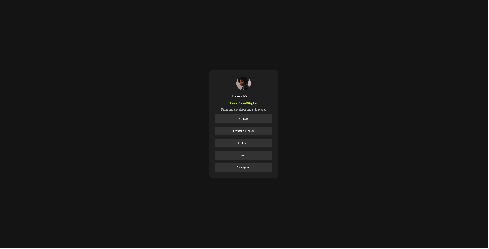

# Frontend Mentor - Social links profile Solution

This is a solution to the [Social links profile challenge on Frontend Mentor](https://www.frontendmentor.io/challenges/social-links-profile-UG32l9m6dQ). Frontend Mentor challenges help you improve your coding skills by building realistic projects. 

## Table of contents

- [Screenshot](#screenshot)
- [My process](#my-process)
  - [Built with](#built-with)
  - [What I learned](#what-i-learned)
  - [Continued development](#continued-development)
- [Author](#author)


## Screenshot



## My process

### Built with

- Semantic HTML5 markup
- CSS custom properties
- Flexbox

### What I learned

```css
a, a:visited, a:hover, a:active {
    text-decoration: none;
}

a, a:visited {
    background-color: hsl(0, 0%, 20%);
    color: white;
}

a:hover, a:active {
    color: hsl(0, 0%, 12%);
    background-color: hsl(75, 94%, 57%);
}
```

I learned about using different states of an element and applying different styles for those particular states.

### Continued development

In further projects, I will keep working on design an color palletes.

## Author

- Website - [Dirk Mosterd](https://www.dirkmosterd.nl)
- Frontend Mentor - [@Dirk-nl](https://www.frontendmentor.io/profile/Dirk-nl)